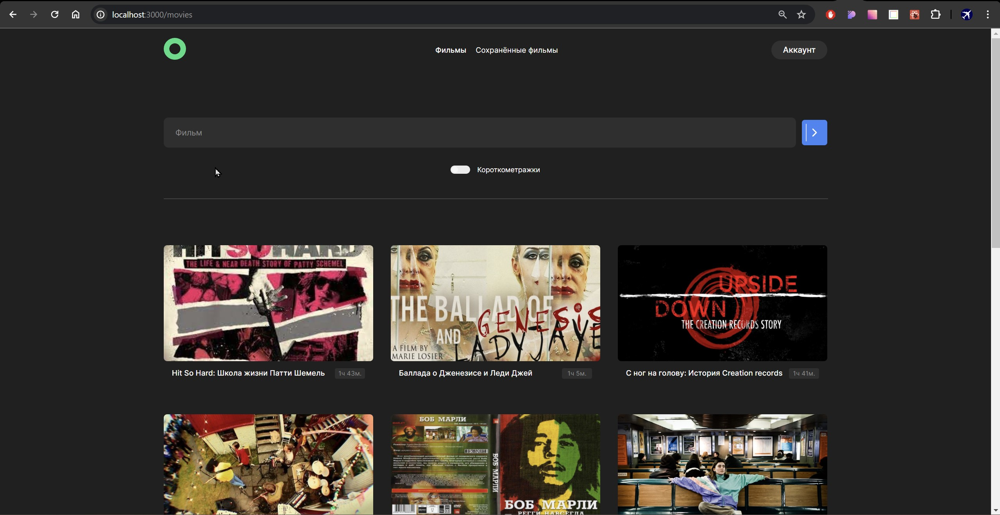

# movies-explorer-frontend
Дипломный проект по курсу web-разработчик от [Yandex.Praktikum](https://practicum.yandex.ru/). Приложение состоит из несколько частей: одна часть это лендинг с описанием изученных технологий, портфолио и небольшой биографией. Вторая часть - приложение поиска кинофильмов, 
которое в свою очередь, состоит из страницы регистрации, авторизации, станицы редактирования пользовательских данных, страницы с результатами поиска и сохраненных фильмов. Функционал поиска фильмов реализована с применением фильтра, выдача результата поиска организована в виде карточек с описанием фильма и его продолжительностью и кнопкой сохранить. При нажатии на карточку открывается окно с трейлером фильма. Нажатие на кнопку "сохранить" добавляет фильм в соответствующий раздел приложения, а нажатие на крестик удаляет. Загрузка фильмов реализована порционно в зависимости от ширины экрана устройства, с возможностью добавления нового ряда карточек кнопкой "Еще". Кроме всего прочего в проекте реализована отзывчивая верстка. Поля форм валидируются на корректность и соответствие паттерну регулярного выражения. Параметры поиска сохраняются в локальное хранилище данных и при перезагрузки страницы данные не теряются.

## О технологиях 
В проекте используется условный рендеринг компонентов, что позволяет скрывать некоторые части приложения при необходимости. Через контекст были внедрены данные пользователя. Пути приложения защищены авторизацией и выполнены с помощью HOC компонента. Живая валидации полей формы реализована с применением кастомного хука. Авторизация выполнена на jwt токене, который сохраняется в локальном хранилище, а при перезагрузке приложения происходит обращение к серверу для подтверждения его валидности и срока годности.

- Семантичская разметка HTML;
- CSS (flexbox, grid);
- React;
- БЭМ.

# Как запустить
- Клонировать репозиторий;
- Установить зависимости;
- Запустить через терминал командой npm run start.
